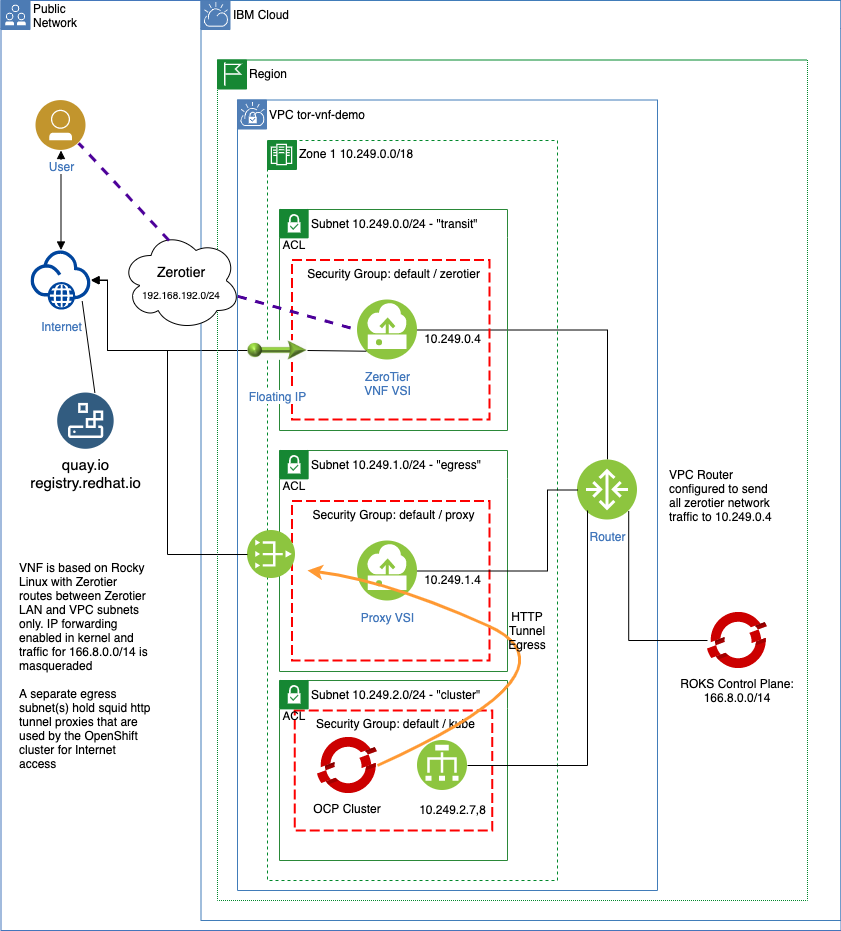

# Egress Proxy Demo

## Description

Demonstration Terraform code to create one VPC and multiple subnets. One subnet will act as a **Transit** subnet which provides internal connectivity using a [ZeroTier VNF](https://github.com/timroster/terraform-vsi-zerotier-edge.git). Due to some routing complexities, the **Transit** subnet approach is currently using a single zone. There is a Floating IP address associated with the VNF instance and a restrictive security group allowing only the transport protocol of the ZeroTier network inbound.

Another set of subnets will be the **Egress** subnets. These subnets will have application layer (HTTP tunnel) proxies running squid on ubuntu servers. The security group applied to the interaces of the proxies is restrictive on inbound private network traffic and permissive outbound to the Internet. Each **Egress** subnet is associated with a VPC Public Gateway. When there is more than 1 egress subnet, the application layer proxies will be front-ended by a private VPC load balancer.

A Red Hat OpenShift cluster will be hosted on a third subnet(s). This **Cluster** subnet will not have any hosts with Floating IP addresses assigned and no VPC Public Gateway. When there is more than 1 cluster subnet, the OpenShift cluster will be created across the zones where the subnets reside. The OpenShift cluster will be deployed with private only endpoints and after it is configured with an internal ingress, a module will run to configure the cluster and workers to use the application proxy in the **Egress** subnet for Internet access. This is the only Internet egress pathway for the cluster. Inbound traffic is limited to hosts only on the ZeroTier network.

## Requirements

This code requires the following tools:

* Terraform >= 0.15 (tested with 1.1.6)
* ibmcloud CLI <https://cloud.ibm.com/docs/cli?topic=cli-install-ibmcloud-cli>
* kubectl <https://kubernetes.io/docs/tasks/tools/#kubectl>

## Input variables to the code

Copy the `example.tfvars` to `terraform.tfvars` providing values for the following:

* IBM Cloud API Key - provide this to allow internal operations (API calls) of the modules in the target account
* IBM Cloud region for creating the deployment
* Name of a public ssh that has been added to the VPC service in the region for the deployment
* Name of the resource group for the deployment
* A prefix to use for all resources
* The ZeroTier network ID - can be pre-existing with workstations for users already enrolled
* The ZeroTier network CIDR - virtual LAN addresses where all ZeroTier clients are assigned addresses

The default deployment will use a single zone and subnet for each tier. The number of egress and cluster subnets can be updated as variables as can the number of cluster workers (default = 2) and flavor of the workers (default 4vcpu / 16GB).

## Usage

After creating the `terraform.tfvars` file with variables required, including any changes to defaulted variables in `variables.tf` run the following commands on a system that has both the `kubectl` and `ibmcloud` applications:

```shell
terraform init
terraform plan
terraform apply
```

## Testing and use

After the run completes you should be able to go to the IBM Cloud Console - select your cluster and log in as usual to the console. All traffic will go over the ZeroTier network to the cluster and the cluster will be able to get container images from the Internet using the HTTP tunnel proxy.

## Functional diagram of topology


